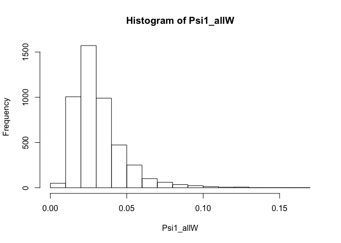
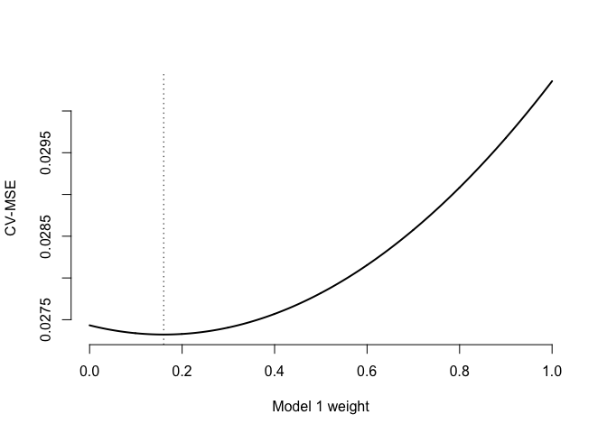
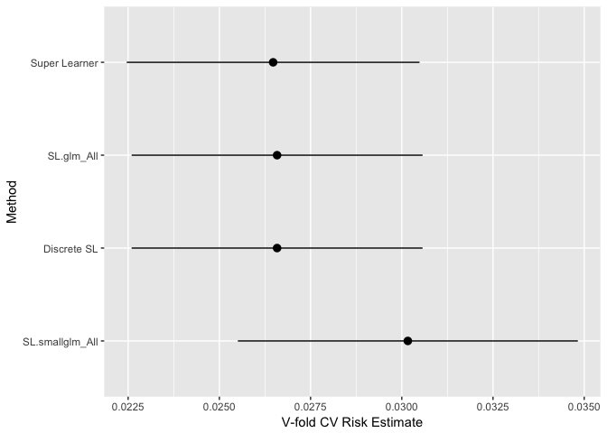

Introduction to Machine Learning
================
David Benkeser
June 27, 2018

<!-- README.md is generated from README.Rmd. Please edit that file -->

## Introduction

In this demonstration, we will illustrate some basic principals
discussed in class using `R`.

## Preliminaries

You can execute the following commands to install the packages needed to
complete this demo.

``` r
# if needed, install all the necessary pacakges to execute this demo
pkgs <- c("SuperLearner", "randomForest", "RCurl", "MASS",
          "ggplot2","nnls")
installed_pacakges <- row.names(installed.packages())
# .libPaths("H:/")
for(p in pkgs){
  # check if p is installed
  already_installed <- p %in% installed_pacakges 
  # if not install it
  if(!already_installed){
    install.packages(p)
  }
  # load package
  library(p, character.only = TRUE)
}
```

I have made a data set available on GitHub that will be used in this
demo. It can be read directly from GitHub using the following
commands:

``` r
web_address <- getURL("https://raw.githubusercontent.com/benkeser/sllecture/master/chspred.csv")
full_data <- read.csv(text = web_address, header = TRUE)
```

We can take a look at the data to make sure it is loaded properly:

``` r
# head displays the first six rows of data
head(full_data)
#>       waist    alcoh      hdl beta smoke ace       ldl      bmi aspirin
#> 1 110.16419 0.000000 66.49739    0     0   1 114.21622 27.99746       0
#> 2  89.97632 0.000000 50.06524    0     0   0 103.77662 20.89314       0
#> 3 106.19407 8.417438 40.50595    0     0   0 165.71580 28.45541       1
#> 4  90.05662 0.000000 36.17505    0     0   0  45.20349 23.96079       0
#> 5  78.61425 2.979014 71.06422    0     1   0 131.31211 10.96558       0
#> 6  91.65934 0.000000 59.49628    0     0   0 171.18718 29.13170       0
#>   gend      age estrgn       glu        ins   cysgfr dm   fetuina
#> 1    0 73.51795      0 159.93141  70.334308 75.00781  1 0.1751561
#> 2    0 61.77225      0 153.38882  33.969450 82.74331  1 0.5716507
#> 3    1 72.93120      0 121.71452 -17.301732 74.69888  0 0.3516775
#> 4    0 79.11913      0  53.96908  11.731511 95.78227  0 0.5439133
#> 5    1 69.01791      0  94.31526   9.711168 72.71094  0 0.4915944
#> 6    1 81.83463      0 212.90660 -28.226900 69.21838  1 0.4621461
#>         whr hsed race   logcystat  logtrig     logcrp       logcre health
#> 1 1.1689797    1    1 -0.34202495 5.406297  2.0125961 -0.673854825      0
#> 2 0.9011436    0    0 -0.08465306 4.859234  3.2932809 -0.555090108      1
#> 3 1.1797129    0    1 -0.44510754 4.508810  0.3013225 -0.011517925      0
#> 4 1.1359920    0    0 -0.48072046 5.183202  3.0242614 -0.575068973      1
#> 5 1.1027589    1    0  0.31206416 4.218965 -0.7056767  0.005340564      1
#> 6 0.9529133    1    0 -0.28715867 5.177331  0.9704625  0.212682488      1
#>    logkcal     sysbp mi
#> 1 4.392559 177.13454  0
#> 2 6.207056 136.37417  0
#> 3 6.731968 135.19927  0
#> 4 7.397201 139.01816  0
#> 5 8.277882  88.04703  0
#> 6 5.994176  69.59431  0
# tail displays the last six rows of data
tail(full_data)
#>          waist     alcoh      hdl beta smoke ace       ldl      bmi
#> 4585  97.80998  0.000000 74.56704    0     0   0  20.39784 22.59396
#> 4586  83.93628  0.000000 39.86891    0     1   0 200.30511 32.93323
#> 4587  98.69020 10.672029 35.08266    0     0   0  56.78766 17.21090
#> 4588  97.68590  0.000000 65.95610    0     0   0 187.39753 19.70763
#> 4589 104.86007  2.800136 43.03691    0     0   0  90.51863 20.83762
#> 4590  73.40203  0.000000 47.69960    0     0   0 128.18095 24.78673
#>      aspirin gend      age estrgn       glu        ins   cysgfr dm
#> 4585       0    0 79.03839      0 171.52806 -59.488629 86.81013  1
#> 4586       0    1 71.93363      0  70.19268  22.904675 65.85595  0
#> 4587       0    1 67.09645      0 137.51263   8.062108 99.62964  0
#> 4588       0    0 87.28538      0 147.96194 -77.834592 85.89258  0
#> 4589       1    0 73.41872      0 135.39740  61.664939 80.74006  0
#> 4590       0    0 69.98629      0  68.06760   1.511657 71.75666  0
#>        fetuina       whr hsed race   logcystat  logtrig     logcrp
#> 4585 0.5125178 0.8675563    0    0  0.08392824 5.249961  2.5213734
#> 4586 0.4535611 0.9854833    0    0  0.62371935 4.314962  0.6269751
#> 4587 0.4897765 1.0881311    1    0 -0.50401479 4.920840 -1.1959170
#> 4588 0.3670600 1.0320420    1    0 -0.37632885 3.560693 -1.0785190
#> 4589 0.5766547 0.7185098    1    0 -0.06307341 4.900429 -0.4000049
#> 4590 0.3559488 0.8614516    0    0  0.37455572 5.461931 -0.4738696
#>           logcre health   logkcal    sysbp mi
#> 4585 -0.47731979      1  7.129744 103.1167  0
#> 4586  0.35042604      1  8.676314 128.7980  0
#> 4587 -0.07601586      1  7.006918 169.3920  0
#> 4588 -0.40555671      1  0.000000 137.0874  0
#> 4589 -0.37884256      1  4.718733 124.9088  0
#> 4590  0.83207825      1 10.625681 126.6630  0
# display the number of observations in the data
nrow(full_data)
#> [1] 4590
# display the number of columns in the data 
ncol(full_data)
#> [1] 28
```

The column `mi` is an indicator of myocardial infarction (heart attack);
all other variables can be considered features. These include
demographic, medical, and other information on participants. We will use
these data to predict myocardial infarction.

## Prediction with logistic regression

Our first exercise is to use logistic regression to predict myocardial
infarction. We will consider two logistic regression models. The first
regresses on `waist`, `smoke`, and `hdl`; the second regresses on all
variables. We will fit these regression models using the full data and
estimate their mean squared-error using the full data.

First, we train the two logistic regressions using the full data and
generate prediction functions (i.e., machines) from which we can
generate new predictions.

``` r
# model 1 -- all variables
model1 <- glm(mi ~ waist + smoke + hdl, data = full_data, family = "binomial")
# can look at the results
summary(model1)
#> 
#> Call:
#> glm(formula = mi ~ waist + smoke + hdl, family = "binomial", 
#>     data = full_data)
#> 
#> Deviance Residuals: 
#>     Min       1Q   Median       3Q      Max  
#> -0.5804  -0.2736  -0.2338  -0.1998   2.9808  
#> 
#> Coefficients:
#>              Estimate Std. Error z value Pr(>|z|)    
#> (Intercept) -1.853886   0.601555  -3.082  0.00206 ** 
#> waist       -0.022654   0.005356  -4.229 2.34e-05 ***
#> smoke        0.625000   0.223766   2.793  0.00522 ** 
#> hdl          0.008611   0.004338   1.985  0.04715 *  
#> ---
#> Signif. codes:  0 '***' 0.001 '**' 0.01 '*' 0.05 '.' 0.1 ' ' 1
#> 
#> (Dispersion parameter for binomial family taken to be 1)
#> 
#>     Null deviance: 1280.4  on 4589  degrees of freedom
#> Residual deviance: 1245.9  on 4586  degrees of freedom
#> AIC: 1253.9
#> 
#> Number of Fisher Scoring iterations: 6
# we can now use model1 to make a "machine", i.e., a function 
# that takes as input features of a new observation and outputs 
# a predicted probability of say Psi1 
Psi1_longway <- function(new_waist, new_smoke, new_hdl, model){
  # extract beta hats from model
  beta0 <- model$coef[1]
  beta1 <- model$coef[2]
  beta2 <- model$coef[3]
  beta3 <- model$coef[4]
  # plogis is the inverse logit function
  # i.e., we compute expit(b0 + b1 * waist + ...)
  prediction <- plogis(beta0 + beta1 * new_waist + beta2 * new_smoke + beta3 * new_hdl)
  # return the prediction
  return(as.numeric(prediction))
}

# try it out on some new data
Psi1_longway(new_waist = 90, new_smoke = 0, new_hdl = 50, model = model1)
#> [1] 0.03040785
Psi1_longway(new_waist = 100, new_smoke = 0, new_hdl = 40, model = model1)
#> [1] 0.0224266
Psi1_longway(new_waist = mean(full_data$waist), 
             new_smoke = 1, 
             new_hdl = mean(full_data$hdl), model = model1)
#> [1] 0.04830798

# we can instead make use of the predict method for glm for a more 
# concise version. here new_features is a data.frame a la full_data
Psi1 <- function(new_features, model){
  # call the predict method
  # type = "response" ensures we get back the expit of the linear predictor
  prediction <- predict(model, newdata = new_features, type = 'response')
  return(as.numeric(prediction))
}

# try it out on some new data
new_features1 <- data.frame(waist = 90, smoke = 0, hdl = 50)
Psi1(new_features = new_features1, model = model1)
#> [1] 0.03040785
new_features2 <- data.frame(waist = 100, smoke = 0, hdl = 40)
Psi1(new_features = new_features2, model = model1)
#> [1] 0.0224266
# also works with multiple rows
new_features3 <- data.frame(waist = c(100,110), smoke = c(0,1), hdl = c(40,60))
Psi1(new_features = new_features3, model = model1)
#> [1] 0.0224266 0.0390102

# the mi ~ . formula fits a main terms logistic regression model
model2 <- glm(mi ~ ., data = full_data, family = "binomial")

#================================================
# Exercise 1:
#================================================
# a. Write a function like Psi1 that predicts for 
# new data based on model2.
# Solution: Simplest way is to just call Psi1 with
# model = model2!
Psi2 <- Psi1

#
# b. Use the function to predict on these the new
# features defined below in predict_me 
predict_me <- data.frame(t(colMeans(full_data[,1:(ncol(full_data)-1)])))
# Solution: Call Psi2 with new_features = predict_me, model = model2
Psi2(new_features = predict_me, model = model2)
#> [1] 0.009879685
#
# c (Bonus!). What values did I put in predict_me?
# Solution: It's the mean values for each feature of the data. 
```

Now, we can compute the mean squared-error for the two logistic
regressions using the full\_data.

``` r
# use Psi1 to obtain predictions on the full data set
Psi1_allW <- Psi1(new_features = full_data, model = model1)
# just for fun, check out some features
summary(Psi1_allW)
#>     Min.  1st Qu.   Median     Mean  3rd Qu.     Max. 
#> 0.006186 0.020539 0.027634 0.031373 0.037474 0.169445
hist(Psi1_allW)
```

<!-- -->

``` r
# now compute the MSE in a way that matches formulas
# presented in class
# how many observations?
n <- nrow(full_data)
# outcome
Y <- full_data$mi
# estimate
mse_Psi1 <- 1/n * sum((Y - Psi1_allW)^2)
mse_Psi1
#> [1] 0.03005748
# or a one-liner
mse_Psi1 <- mean((full_data$mi - Psi1_allW)^2)
mse_Psi1
#> [1] 0.03005748

#================================================
# Exercise 2:
#================================================
# a. Compute the estimated MSE for Psi2. 
# mse_Psi2 <- ... 
# Solution: 
Psi2_allW <- Psi2(new_features = full_data, model = model2)
mse_Psi2 <- mean((Y - Psi2_allW)^2) 
mse_Psi2
#> [1] 0.02536199
#
# b. (Bonus!) Negative log-likelihood loss is an alternative
# loss function, L(psi,o) = -log(psi(x)^y + (1-psi(x))^(1-y)),
# where o = (x,y).
# Compute the estimated average negative log-likelihood for
# both Psi1 and Psi2. 
#
nloglik_Psi2 <- mean(-(Y * log(Psi2_allW) + (1-Y)*log(1 - Psi2_allW)))
nloglik_Psi2
#> [1] 0.1028601
```

As discussed in class, using the same data to train algorithms as to
evaluate them leads to overly optimistic estimates of performance. This
fact motivated the use of cross-validation. Here, we use two-fold
cross-validation to estimate the MSE of the two logistic regression
models.

``` r
# first we assign a split for each of the n observations
# here, we use the first half of data as one split, the second
# half of the data as the other split
split <- sort(rep(c(1,2),round(n/2,0)))
# take a look to make sure the right number in each split
table(split)
#> split
#>    1    2 
#> 2295 2295

# now define first training sample and validation sample
train1 <- full_data[split == 1,]
valid1 <- full_data[split == 2,]

# similarly, reverse their roles
train2 <- full_data[split == 2,]
valid2 <- full_data[split == 1,]

# now fit model1 using only train1 data
model1_train1 <- glm(mi ~ waist + smoke + hdl, data = train1, family = "binomial")
# take a peak
model1_train1
#> 
#> Call:  glm(formula = mi ~ waist + smoke + hdl, family = "binomial", 
#>     data = train1)
#> 
#> Coefficients:
#> (Intercept)        waist        smoke          hdl  
#>   -0.854339    -0.024073     0.464426    -0.008184  
#> 
#> Degrees of Freedom: 2294 Total (i.e. Null);  2291 Residual
#> Null Deviance:       591.5 
#> Residual Deviance: 580.1     AIC: 588.1

# now we will evaluate MSE in valid1
# note we can still use the Psi1 function, but just change
# the model statement
Psi1_valid1W <- Psi1(new_features = valid1, model = model1_train1)
# take a peak
head(Psi1_valid1W)
#> [1] 0.03959560 0.03684553 0.01492446 0.02917764 0.01625422 0.03405874
# compute the MSE
mse_Psi1_valid1 <- mean((valid1$mi - Psi1_valid1W)^2)

# now reverse the roles!
# fit model1 using only train2 data
model1_train2 <- glm(mi ~ waist + smoke + hdl, data = train2, family = "binomial")
# take a peak
model1_train2
#> 
#> Call:  glm(formula = mi ~ waist + smoke + hdl, family = "binomial", 
#>     data = train2)
#> 
#> Coefficients:
#> (Intercept)        waist        smoke          hdl  
#>    -2.74398     -0.02123      0.72776      0.01977  
#> 
#> Degrees of Freedom: 2294 Total (i.e. Null);  2291 Residual
#> Null Deviance:       687.6 
#> Residual Deviance: 656.2     AIC: 664.2

# now we will evaluate MSE in valid1
# note we can still use the Psi1 function, but just change
# the model statement
Psi1_valid2W <- Psi1(new_features = valid2, model = model1_train2)
# take a peak
head(Psi1_valid2W)
#> [1] 0.02256396 0.02497107 0.01480289 0.01905850 0.09273421 0.02891445
# compute the MSE
mse_Psi1_valid2 <- mean((valid2$mi - Psi1_valid2W)^2)

# average the two to get a cross-validated estimate of MSE
cv_mse_Psi1 <- (mse_Psi1_valid1 + mse_Psi1_valid2) / 2
cv_mse_Psi1
#> [1] 0.03035721
#================================================
# Exercise 3:
#================================================
# a. Compute the cross-validated MSE for model2.
model2_train1 <- glm(mi ~ ., data = train1, family = "binomial")
Psi2_valid1W <- Psi2(new_features = valid1, model = model2_train1)
mse_Psi2_valid1 <- mean((valid1$mi - Psi2_valid1W)^2)

model2_train2 <- glm(mi ~ ., data = train2, family = "binomial")
Psi2_valid2W <- Psi2(new_features = valid2, model = model2_train2)
mse_Psi2_valid2 <- mean((valid2$mi - Psi2_valid2W)^2)

cv_mse_Psi2 <- (mse_Psi2_valid1 + mse_Psi2_valid2) / 2
cv_mse_Psi2
#> [1] 0.02743314
# b. How does it compare to MSE for model1?
cv_mse_Psi2 < cv_mse_Psi1
#> [1] TRUE

# c. What estimator would cross-validation have us select?
# Psi2 -- the full logistic regression
```

What about an ensemble estimator of the two? Recall that a stacked
regression (aka a super learner) is a convex combination of multiple
models. Here we demonstrate how to determine the weights that minimize
cross-validated MSE over all convex combinations.

``` r
# we need to define a new machine that takes both model1 and model2 
# in and returns a weighted combination of their predictions
Psi_sl <- function(new_features, model1, model2,
                   model1_weight, model2_weight = 1 - model1_weight){
  # make sure weights approximately sum to 1
  stopifnot(abs(1 - model1_weight - model2_weight) < 1e-5)
  # prediction from model 1 on new data
  model1_prediction <- predict(model1, newdata = new_features, type = 'response')
  # prediction from model 2 on new data
  model2_prediction <- predict(model2, newdata = new_features, type = 'response')
  # weighted combination
  ensemble_prediction <- model1_weight * model1_prediction + 
                            model2_weight * model2_prediction
  return(as.numeric(ensemble_prediction))
}

# test it out on the first observation using full data models and equal weights
# should be the same as 
# 0.5 * Psi1(full_data[1,], model = model1) + 0.5 * Psi2(full_data[1,], model = model2)
Psi_sl(new_features = full_data[1,], model1 = model1, model2 = model2,
       model1_weight = 0.5)
#> [1] 0.0177746

# try different weights
Psi_sl(new_features = full_data[1,], model1 = model1, model2 = model2,
       model1_weight = 0.25)
#> [1] 0.01547143

# We could also apply this to the training data models. e.g., 
# here we use model1 and model2 fit to training data
Psi_sl(new_features = valid1[1,], model1 = model1_train1, model2 = model2_train1,
       model1_weight = 0.5)
#> [1] 0.04770049

# So, for a given set of weights, we could estimate a cross-validated MSE for 
# the weight combination as follows. 
Psi_sl_valid1W <- Psi_sl(new_features = valid1, 
                          model1 = model1_train1, 
                          model2 = model2_train1,
                          model1_weight = 0.5)
# compute the MSE
mse_Psi_sl_valid1 <- mean((valid1$mi - Psi_sl_valid1W)^2)

# now reverse the roles!
Psi_sl_valid2W <- Psi_sl(new_features = valid2, 
                       model1 = model1_train2,
                       model2 = model2_train2,
                       model1_weight = 0.5)
# take a peak
head(Psi_sl_valid2W)
#> [1] 0.023542851 0.055579467 0.009674798 0.015279893 0.150463410 0.015096541
# compute the MSE
mse_Psi_sl_valid2 <- mean((valid2$mi - Psi_sl_valid2W)^2)

# average the two to get a cross-validated estimate of MSE
cv_mse_Psi_sl <- (mse_Psi_sl_valid1 + mse_Psi_sl_valid2) / 2


# Let's wrap all of these commands up in a function that computes
# the cross-validated MSE for a given choice of model weights
# Note: this is technically bad form for function writing, since I'm 
# relying on model1 and model2 being available in the global 
# environment and if not the function will break; however, for simplicity
# I will ignore this issue. 

compute_cv_mse <- function(model1_weight){
  Psi_sl_valid1W <- Psi_sl(new_features = valid1, 
                            model1 = model1_train1, 
                            model2 = model2_train1,
                            model1_weight = model1_weight)
  # compute the MSE
  mse_Psi_sl_valid1 <- mean((valid1$mi - Psi_sl_valid1W)^2)

  # now reverse the roles!
  Psi_sl_valid2W <- Psi_sl(new_features = valid2, 
                         model1 = model1_train2,
                         model2 = model2_train2,
                         model1_weight = model1_weight)
  # take a peak
  head(Psi_sl_valid2W)
  # compute the MSE
  mse_Psi_sl_valid2 <- mean((valid2$mi - Psi_sl_valid2W)^2)

  # average the two to get a cross-validated estimate of MSE
  cv_mse_Psi_sl <- (mse_Psi_sl_valid1 + mse_Psi_sl_valid2) / 2
  return(cv_mse_Psi_sl)
}

# Now, we can compute the MSE for a grid of model1_weight values
many_different_weights <- seq(0, 1, length = 1000)
mse_for_each_weight <- rep(NA, 1000)
for(i in seq_len(1000)){
  mse_for_each_weight[i] <- compute_cv_mse(many_different_weights[i])
}
# take a peak 
head(mse_for_each_weight)
#> [1] 0.02743314 0.02743176 0.02743039 0.02742903 0.02742768 0.02742633
# determine which weight led to the smallest cross-validated MSE
min_idx <- which.min(mse_for_each_weight)
opt_model1_weight <- many_different_weights[min_idx]

# plot 
plot(mse_for_each_weight ~ many_different_weights, type = "l", lwd = 2,
     bty = "n", xlab = "Model 1 weight", ylab = "CV-MSE")
# add a line at the minimum value
abline(v = opt_model1_weight, lty = 3)
```

<!-- -->

Note that we have now used the data to determine our ensemble weights
and thus the in-sample error estimate for the ensemble is likely to be
overly optimistic for the true MSE of the ensemble. We could use an
outer layer of cross-validation to evaluate the ensembles performance.

``` r
#================================================
# Exercise 4:
#
# a (BONUS) Determine the cross-validated MSE of
# the super learner ensemble. 
# Hint: Split the data into e.g., two pieces and in 
# each piece run the above code to determine the
# optimal ensemble. Then get predictions based on
# that ensemble in the other piece. 
#================================================
```

## The `SuperLearner` pacakge

While this professor may have just made you code up your own
cross-validation-based ensemble by hand, thankfully, others have written
`R` packages that do this for us. We will discuss the `SuperLearner`
package and how it can be used to fit CV-based ensembles or to tune
particular machine learning algorithms.

We begin by illustrating the “default” functionality of the
`SuperLearner` function. For the sake of computational expediency, we
will initially consider only a simple library of algorithms: a main
effects GLM and an unadjusted (i.e., intercept) model. Later, we will
look at how these algorithms are constructed for usage with
`SuperLearner`.

``` r
# because cross-validation is used, we need to set to the seed to ensure reproducibility
set.seed(1234)

# execute the call to SuperLearner
sl1 <- SuperLearner(
  # Y is the outcome variable
  Y = full_data$mi,
  # X is a dataframe of features, in this case
  # everything in full_data except for mi
  X = full_data[,-ncol(full_data)], 
  # newX will be discussed later, for now leave as NULL (default)
  newX = NULL,
  # family will be discussed in more detail when we see how wrappers
  # are written, for now set to binomial() for 0/1 outcome
  family = binomial(), 
  # SL.library (for now) is specified as a vector of names of functions
  # that implement the desired algorithms. SL.glm and SL.mean
  # are included in the Super Learner package
  SL.library = c("SL.glm","SL.mean"),
  # method specifies how the ensembling is done, for now we will use
  # the \sum_{k=1}^K \alpha_k f_{k,n} method by using the default
  # option for method (method.NNLS)
  method = "method.NNLS",
  # id specifies a unique subject identifier so that whole subjects 
  # are sampled in CV, not just rows of data. full_data only has one row 
  # per subject, so OK to leave as NULL (default)
  id = NULL, 
  # verbose controls the printing of messages of SuperLearner's progress.
  # We'll leave as FALSE (default) for now
  verbose = FALSE, 
  # control contains options related to logistic ensemble (trimLogit) 
  # and whether to save the fit library to look at individual 
  # algorithms later. We will leave as default
  control = list(saveFitLibrary = TRUE, trimLogit = 0.001),
  # cvControl specifies parameters related to cross validation. Of note
  # the default is for V=10-fold cross validation. See ?SuperLearner
  # for more details
  cvControl = list(V = 10L, stratifyCV = FALSE, shuffle = TRUE, 
                   validRows = NULL)
)

sl1
#> 
#> Call:  
#> SuperLearner(Y = full_data$mi, X = full_data[, -ncol(full_data)], newX = NULL,  
#>     family = binomial(), SL.library = c("SL.glm", "SL.mean"), method = "method.NNLS",  
#>     id = NULL, verbose = FALSE, control = list(saveFitLibrary = TRUE,  
#>         trimLogit = 0.001), cvControl = list(V = 10L, stratifyCV = FALSE,  
#>         shuffle = TRUE, validRows = NULL)) 
#> 
#> 
#>                   Risk      Coef
#> SL.glm_All  0.02658219 0.8871921
#> SL.mean_All 0.03041508 0.1128079
```

From the output, we see that SL.glm\_All had the lowest cross-validated
risk and is thus the cross-validation-selected estimator (aka the
discrete Super Learner). We will discuss why the name of each algorithm
has been augmented with the suffix `_All` when we illustrate variable
screening functions later in the document.

Predictions from the discrete and continuous Super Learner on the
observed data can now be obtained as follows:

``` r
# default call to predict
slPred <- predict(sl1)
# slPred is a list with two components
#   pred = continuous SL predictions
#   library.predict = predictions from each algorithm

# store the continuous SL predictions
cslPred <- slPred$pred

# get the discrete SL predictions
dslPred <- slPred$library.predict[,which(sl1$cvRisk==min(sl1$cvRisk))]
```

We can also obtain predictions on a new observation:

``` r
# generate a new observation set to the mean of each variable
newObs <- data.frame(t(colMeans(full_data[,-ncol(full_data)])))

# all predictions on newObs
slPredNew <- predict(sl1,newdata=newObs)

# continuous SL prediction on newObs
cslPredNew <- slPredNew$pred

# discrete SL prediction on newObs
dslPredNew <- slPredNew$library.predict[,which.min(sl1$cvRisk)]
```

If one wishes to access the fitted object for any of the component
algorithms (applied to all the data), this can be accessed through the
`fitLibrary` component of the `SuperLearner` object. For example, to
access the `glm` object from the `SL.glm` algorithm, we can use:

``` r
# obtain gamma GLM with log-link fit
glmObject <- sl1$fitLibrary$SL.glm$object

# summarize the fit
summary(glmObject)
#> 
#> Call:
#> glm(formula = Y ~ ., family = family, data = X, weights = obsWeights, 
#>     model = model)
#> 
#> Deviance Residuals: 
#>     Min       1Q   Median       3Q      Max  
#> -1.4162  -0.2271  -0.1342  -0.0766   3.5835  
#> 
#> Coefficients:
#>               Estimate Std. Error z value Pr(>|z|)    
#> (Intercept)  5.4405844  1.9012226   2.862  0.00421 ** 
#> waist       -0.0064552  0.0071065  -0.908  0.36370    
#> alcoh        0.1127744  0.0110880  10.171  < 2e-16 ***
#> hdl          0.0044309  0.0052140   0.850  0.39543    
#> beta         0.3328622  0.2747572   1.211  0.22571    
#> smoke        0.1358397  0.2704664   0.502  0.61550    
#> ace          0.3195770  0.2900528   1.102  0.27055    
#> ldl         -0.0155763  0.0019280  -8.079 6.54e-16 ***
#> bmi         -0.1718827  0.0188935  -9.097  < 2e-16 ***
#> aspirin      0.1921275  0.1940136   0.990  0.32204    
#> gend         0.1720266  0.2266058   0.759  0.44777    
#> age         -0.0498989  0.0165272  -3.019  0.00253 ** 
#> estrgn      -0.2844683  0.3469420  -0.820  0.41226    
#> glu         -0.0016521  0.0024212  -0.682  0.49503    
#> ins          0.0009482  0.0022495   0.422  0.67338    
#> cysgfr      -0.0071902  0.0045757  -1.571  0.11609    
#> dm           0.4097270  0.2472677   1.657  0.09752 .  
#> fetuina     -0.3428327  0.7446875  -0.460  0.64525    
#> whr          0.0397150  0.7534039   0.053  0.95796    
#> hsed         0.0805406  0.1955452   0.412  0.68043    
#> race         0.0936239  0.2876978   0.325  0.74486    
#> logcystat   -0.0288129  0.3140621  -0.092  0.92690    
#> logtrig     -0.0586191  0.1576144  -0.372  0.70996    
#> logcrp      -0.0336396  0.0715266  -0.470  0.63813    
#> logcre      -0.2222800  0.2643888  -0.841  0.40050    
#> health       0.2299788  0.2707350   0.849  0.39562    
#> logkcal      0.0325390  0.0410616   0.792  0.42810    
#> sysbp        0.0047877  0.0033635   1.423  0.15461    
#> ---
#> Signif. codes:  0 '***' 0.001 '**' 0.01 '*' 0.05 '.' 0.1 ' ' 1
#> 
#> (Dispersion parameter for binomial family taken to be 1)
#> 
#>     Null deviance: 1280.44  on 4589  degrees of freedom
#> Residual deviance:  944.26  on 4562  degrees of freedom
#> AIC: 1000.3
#> 
#> Number of Fisher Scoring iterations: 7
```

## Writing algorithms for Super Learner

The `SuperLearner` functions works by doing cross-validation of each
algorithm that is included in the `SL.library` option. These character
inputs correspond to functions that are included in the `SuperLearner`
package that implement various machine learning algorithms. We can check
the algorithms that are included in the `SuperLearner` by default:

``` r
listWrappers()
#> All prediction algorithm wrappers in SuperLearner:
#>  [1] "SL.bartMachine"      "SL.bayesglm"         "SL.biglasso"        
#>  [4] "SL.caret"            "SL.caret.rpart"      "SL.cforest"         
#>  [7] "SL.dbarts"           "SL.earth"            "SL.extraTrees"      
#> [10] "SL.gam"              "SL.gbm"              "SL.glm"             
#> [13] "SL.glm.interaction"  "SL.glmnet"           "SL.ipredbagg"       
#> [16] "SL.kernelKnn"        "SL.knn"              "SL.ksvm"            
#> [19] "SL.lda"              "SL.leekasso"         "SL.lm"              
#> [22] "SL.loess"            "SL.logreg"           "SL.mean"            
#> [25] "SL.nnet"             "SL.nnls"             "SL.polymars"        
#> [28] "SL.qda"              "SL.randomForest"     "SL.ranger"          
#> [31] "SL.ridge"            "SL.rpart"            "SL.rpartPrune"      
#> [34] "SL.speedglm"         "SL.speedlm"          "SL.step"            
#> [37] "SL.step.forward"     "SL.step.interaction" "SL.stepAIC"         
#> [40] "SL.svm"              "SL.template"         "SL.xgboost"
#> 
#> All screening algorithm wrappers in SuperLearner:
#> [1] "All"
#> [1] "screen.corP"           "screen.corRank"        "screen.glmnet"        
#> [4] "screen.randomForest"   "screen.SIS"            "screen.template"      
#> [7] "screen.ttest"          "write.screen.template"
```

Note that both “prediction” and “screening”" algorithms are shown. We
focus first on prediction algorithms; screening algorithms are discussed
in the next section. Let’s look at the guts of the `SL.glm` algorithm:

``` r
SL.glm
#> function (Y, X, newX, family, obsWeights, model = TRUE, ...) 
#> {
#>     if (is.matrix(X)) {
#>         X = as.data.frame(X)
#>     }
#>     fit.glm <- glm(Y ~ ., data = X, family = family, weights = obsWeights, 
#>         model = model)
#>     if (is.matrix(newX)) {
#>         newX = as.data.frame(newX)
#>     }
#>     pred <- predict(fit.glm, newdata = newX, type = "response")
#>     fit <- list(object = fit.glm)
#>     class(fit) <- "SL.glm"
#>     out <- list(pred = pred, fit = fit)
#>     return(out)
#> }
#> <environment: namespace:SuperLearner>
```

Note that `SL.glm` is a function that takes as input: `Y`, `X`, `newX`,
`family`, `obsWeights`, and other arguments via `...`. The `family`
option allows one to use `SL.glm` when the outcome is both binary and
continuous. In this case, `SL.glm` with `family=gaussian()` will call
`glm` with `family=gaussian()` (linear regression); with
`family=binomial()` it calls `glm` with `family=binomial()` (logistic
regression).

The output of the function must be in a specific format: a list with
components `pred`, a vector of predictions computed on the `newX` object
(not `X`\! source of many errors in my life…), and `fit`, which contains
anything that is (1) required for predicting new values later; or (2)
desired for later access via the `fitLibrary` component of the
`SuperLearner` object. Because this `fit` object may be used for
prediction later, it is important to specify its class so that an S3
predict method can be used on the object later. Note that such a method
is already included for `SL.glm`:

``` r
predict.SL.glm
#> function (object, newdata, ...) 
#> {
#>     if (is.matrix(newdata)) {
#>         newdata = as.data.frame(newdata)
#>     }
#>     pred <- predict(object = object$object, newdata = newdata, 
#>         type = "response")
#>     pred
#> }
#> <environment: namespace:SuperLearner>
```

This input/output structure is all that is needed to define a new
prediction algorithm for `SuperLearner`. As an illustration, we could
write a new algorithm specifying a our `glm` that used only `waist`,
`smoke`, and
`hdl`.

``` r
# the function must have named arguments Y, X, newX, family, obsWeights, but
# could have other arguments as well. 
SL.smallglm <- function(Y, X, newX, family, obsWeights, ...){

  if(family$family == "gaussian"){
    stop("We only care about using logistic regression right now.")
  }

  # the data that will be seen by SL.small glm will be a vector outcome
  # Y and a data.frame of predictors X, which will in particular include
  # columns named waist, smoke, hdl
  model2 <- glm(Y ~ waist + smoke + hdl, data = X, family = binomial())
  
  # get predictions on newX object as we did in Psi1 above
  pred <- predict(model2, newdata = newX, type = "response")
  
  # save the fit object
  fit <- list(object = model2)
  
  # because this is simply a different form of glm, 
  # we can use predict.SL.glm to get predictions back, 
  # i.e. no need to write a new predict function
  class(fit) <- "SL.glm"
  
  # out must be list with named objects pred (predictions on newX)
  # and fit (anything needed to get predictions later)
  out <- list(pred = pred, fit = fit)
  return(out)
}
```

We have now defined a new algorithm for use in the SuperLearner.

This new algorithms can now be added to the library we used previously:

``` r
set.seed(1234)

sl2 <- SuperLearner(
  Y = full_data$mi,
  X = full_data[,-ncol(full_data)],
  SL.library = c("SL.glm","SL.smallglm"),
  family = binomial()
  )

sl2
#> 
#> Call:  
#> SuperLearner(Y = full_data$mi, X = full_data[, -ncol(full_data)], family = binomial(),  
#>     SL.library = c("SL.glm", "SL.smallglm")) 
#> 
#> 
#>                       Risk      Coef
#> SL.glm_All      0.02658219 0.8877015
#> SL.smallglm_All 0.03016603 0.1122985
```

The weights may be different than those computed via grid search since
(1) by default `SuperLearner` uses 10-fold cross-validation and (2) the
ensemble for `family = binomial()` is done based on negative
log-likelihood, not MSE. They should be ballpark similar though.

We can double check to make sure that `predict.SL.glm` works for our the
new algorithm we defined by attempting to predict on a new observation:

``` r
slPredNew2 <- predict(sl2, newdata = newObs)
slPredNew2
#> $pred
#>            [,1]
#> [1,] 0.01193353
#> 
#> $library.predict
#>       SL.glm_All SL.smallglm_All
#> [1,] 0.009879685      0.02816883
```

## Machine learning algorithms included in the super learner

We have been focusing on generalized linear models for simplicity;
however, there are many more complex algorithms included in the super
learner. We discussed several of these algorithms in class (e.g., random
forest `SL.randomForest`, gradient boosting `SL.gbm`, neural networks
`SL.nnet`).

We can look at each of these functions to see (1) what packages are
needed to execute the function; (2) the syntax of a normal call to the
function; and (3) what tuning parameters there are. For example, let’s
look at `SL.randomForest`

``` r
SL.randomForest
#> function (Y, X, newX, family, mtry = ifelse(family$family == 
#>     "gaussian", max(floor(ncol(X)/3), 1), floor(sqrt(ncol(X)))), 
#>     ntree = 1000, nodesize = ifelse(family$family == "gaussian", 
#>         5, 1), maxnodes = NULL, importance = FALSE, ...) 
#> {
#>     .SL.require("randomForest")
#>     if (family$family == "gaussian") {
#>         fit.rf <- randomForest::randomForest(Y ~ ., data = X, 
#>             ntree = ntree, xtest = newX, keep.forest = TRUE, 
#>             mtry = mtry, nodesize = nodesize, maxnodes = maxnodes, 
#>             importance = importance)
#>         pred <- fit.rf$test$predicted
#>         fit <- list(object = fit.rf)
#>     }
#>     if (family$family == "binomial") {
#>         fit.rf <- randomForest::randomForest(y = as.factor(Y), 
#>             x = X, ntree = ntree, xtest = newX, keep.forest = TRUE, 
#>             mtry = mtry, nodesize = nodesize, maxnodes = maxnodes, 
#>             importance = importance)
#>         pred <- fit.rf$test$votes[, 2]
#>         fit <- list(object = fit.rf)
#>     }
#>     out <- list(pred = pred, fit = fit)
#>     class(out$fit) <- c("SL.randomForest")
#>     return(out)
#> }
#> <environment: namespace:SuperLearner>
```

The line `.SL.require("randomForest")` indicates that we need to have
the `randomForest` `R` package installed to use this function. The calls
to `randomForest` (`fit.rf <- ...`) illustrate the syntax of calls to
randomForest. The other options that are passed from `SL.randomForest`
to `randomForest` are the tuning parameters for the algorithm (`mtry`,
`ntree`, `nodesize`, `maxnodes`, …). These are generally given sane
default values, but we may wish to include multiple choices as well.

The `SuperLearner` package can easily be used to implement a single
method with different tuning parameter values. As an example, consider
using random forests. We will consider three tuning parameters: the
number of trees to build `ntree`, the size of the trees `nodesize`, and
the number of randomly sampled covariates for each tree `mtry`.

We can define a new function that uses a single set of values for these
parameters:

``` r
# here we simply pass through these values to SL.randomForest
SL.rf_m5_nt1000_ns3 <- function(..., mtry = 5, ntree = 1000, nodesize = 3){
  SL.randomForest(..., mtry = mtry, ntree = ntree, nodesize = nodesize)
}
```

We can also use a loop to define functions over a grid of tuning
parameter
values:

``` r
tuneGrid <- expand.grid(mtry = c(3,5), ntree=c(500,1000), nodesize=c(1,3))

for(i in seq(nrow(tuneGrid))) { 
  eval(parse(text = paste0("SL.rf_m",tuneGrid[i,1],"_nt",tuneGrid[i,2],"_ns",tuneGrid[i,3], 
                      "<- function(..., mtry = ", tuneGrid[i, 1], ", ntree = ", tuneGrid[i, 2], 
                      ", nodesize = ", tuneGrid[i,3],") { SL.randomForest(..., mtry = mtry, ntree = ntree, nodesize=nodesize)}")))
  }
```

We have now created eight new prediction algorithms with each
combination of tuning parameters specified in `tuneGrid`. For example,
we can look at the algorithm that uses `mtry=3`, `ntree=500`, and
`nodesize=1`:

``` r
SL.rf_m3_nt500_ns1
#> function (..., mtry = 3, ntree = 500, nodesize = 1) 
#> {
#>     SL.randomForest(..., mtry = mtry, ntree = ntree, nodesize = nodesize)
#> }
```

We can collect all of these algorithms by searching through `R` objects
with a similar name:

``` r
# get vector of all objects in R
allObjects <- ls()
# search names of objects for 'SL.randomForest_m'
allrfobjects <- grep("SL.rf_m",allObjects)
# get only objects with 'SL.randomForest_m' in their name
allRf <- allObjects[allrfobjects]
allRf
#> [1] "SL.rf_m3_nt1000_ns1" "SL.rf_m3_nt1000_ns3" "SL.rf_m3_nt500_ns1" 
#> [4] "SL.rf_m3_nt500_ns3"  "SL.rf_m5_nt1000_ns1" "SL.rf_m5_nt1000_ns3"
#> [7] "SL.rf_m5_nt500_ns1"  "SL.rf_m5_nt500_ns3"
```

We can now use Super Learner to evaluate the performance of the random
forest method using various tuning parameter values:

``` r
# this will take a while since we are fitting 8x(10 + 1) 
# random forests.
rf.sl <- SuperLearner(
  Y = full_data$mi, 
  X = full_data[,-ncol(full_data)],
  family = binomial(),
  method="method.NNLS",
  SL.library = allRf
  )

rf.sl
#> 
#> Call:  
#> SuperLearner(Y = full_data$mi, X = full_data[, -ncol(full_data)], family = binomial(),  
#>     SL.library = allRf, method = "method.NNLS") 
#> 
#> 
#>                               Risk       Coef
#> SL.rf_m3_nt1000_ns1_All 0.02798615 0.00000000
#> SL.rf_m3_nt1000_ns3_All 0.02794101 0.00000000
#> SL.rf_m3_nt500_ns1_All  0.02795937 0.07225953
#> SL.rf_m3_nt500_ns3_All  0.02798630 0.00000000
#> SL.rf_m5_nt1000_ns1_All 0.02785780 0.67307311
#> SL.rf_m5_nt1000_ns3_All 0.02787465 0.25466735
#> SL.rf_m5_nt500_ns1_All  0.02799607 0.00000000
#> SL.rf_m5_nt500_ns3_All  0.02791834 0.00000000
```

## Screening algorithms for the Super Learner

We now discuss how screening algorithms can be utilized to create Super
Learner libraries. As the name suggests, these are algorithms that
define a screening step prior to the execution of the prediction
algorithm. The `SuperLearner` function will apply this screening step in
each of the V folds. The combination of screening algorithm and
prediction algorithm defines a new algorithm. We can look at how
screening algorithms are constructed for use with the `SuperLearner`
package:

``` r
write.screen.template()
#> screen.template <- function(Y, X, family, obsWeights, id, ...) {
#>   # load required packages
#>   # require('pkg')
#>   if (family$family == 'gaussian') {
#>     
#>   }
#>   if (family$family == 'binomial') {
#>   
#>   }
#>   # whichVariable is a logical vector,
#>   # TRUE indicates variable will be used
#>   whichVariable <- rep(TRUE, ncol(X))
#>   return(whichVariable)
#> }
```

Screening algorithms take the same input as prediction algorithms, but
output a logical vector with `TRUE` indicating that a column of `X`
should be used in the prediction step. To illustrate why these functions
are useful, in our running example, consider the possibility of an
interaction between treatment and SOFA score. If we are unsure of the
existence of this interaction, we may wish to include algorithms that
both do and do not account for this interaction. To construct a new
library that includes algorithms both with and without interactions, we
can make use of screening algorithms.

Let’s write a screening algorithm that only includes demographic
variables:

``` r
demographics <- function(X,...){
  returnCols <- rep(FALSE, ncol(X))
  returnCols[names(X) %in% c("age","gend","race","hsed")] <- TRUE
  return(returnCols)
}
```

Now we can fit the SuperLearner using the two GLMs both with all
variables and only demographic variables. The call to `SuperLearner` is
nearly identical; however, we now specify `SL.library` as a list, where
each component is a vector of the form
`c(predictionAlgorithm,screeningAlgorithm)`. To include all the
covariates, we specify the `All` screening algorithm that is included in
the `SuperLearner` package.

``` r
set.seed(1234) 

# Fit the Super Learner
sl3 <- SuperLearner(
  Y = full_data$mi,
  X = full_data[,-ncol(full_data)],
  SL.library=list(c("SL.glm","All"),
                  c("SL.glm","demographics"),
                  c("SL.mean","All"), # not adjusted, so doesn't matter
                  c("SL.smallglm","All")),
  family = binomial()
  )

sl3
#> 
#> Call:  
#> SuperLearner(Y = full_data$mi, X = full_data[, -ncol(full_data)], family = binomial(),  
#>     SL.library = list(c("SL.glm", "All"), c("SL.glm", "demographics"),  
#>         c("SL.mean", "All"), c("SL.smallglm", "All"))) 
#> 
#> 
#>                           Risk       Coef
#> SL.glm_All          0.02658219 0.88191870
#> SL.glm_demographics 0.03031070 0.01335312
#> SL.mean_All         0.03041508 0.01455926
#> SL.smallglm_All     0.03016603 0.09016893
```

Note that the output for `sl3` lists five algorithms: the three original
algorithms each with the interaction (`_All`) and without
(`_demographics`). Note that this explains why the output for `sl1`
contained the `_All` addendum: by default `SuperLearner` uses all the
`All` screening function to pass through all variables in `X` to the
prediction algorithms.

This flexibility in combining screening and prediction algorithms to
generate new algorithms allows one to easily implement a library
containing a large number of candidate algorithms. Check out
`listWrappers()` to see other screening functions that are useful for
more high dimensional settings.

## Using different loss/ensemble functions

So far, we have been focusing on using mean-squared error loss, by
virtue of using the default `method=method.NNLS`. Because our outcome is
binary, we may instead prefer the negative log-likelihood loss function
instead. We can easily change our original call to `SuperLearner` to
this loss function:

``` r
set.seed(1234)

sl4 <- SuperLearner(
  Y = full_data$mi,
  X = full_data[,-ncol(full_data)], 
  SL.library=c("SL.glm","SL.mean"),
  method = "method.NNloglik",
  family = binomial()
  )

sl4
#> 
#> Call:  
#> SuperLearner(Y = full_data$mi, X = full_data[, -ncol(full_data)], family = binomial(),  
#>     SL.library = c("SL.glm", "SL.mean"), method = "method.NNloglik") 
#> 
#> 
#>                  Risk      Coef
#> SL.glm_All  0.1096895 0.9060648
#> SL.mean_All 0.1399198 0.0939352
```

We may wish instead to maximize AUC (equivalent to minimizing rank
loss); for this, we can specify `method=method.AUC`:

``` r
set.seed(1234)

sl5 <- SuperLearner(
  Y = full_data$mi,
  X = full_data[,-ncol(full_data)], 
  SL.library=c("SL.glm","SL.mean"),
  method = "method.AUC",
  family=binomial()
  )
#> Loading required package: cvAUC
#> Loading required package: ROCR
#> Loading required package: gplots
#> 
#> Attaching package: 'gplots'
#> The following object is masked from 'package:stats':
#> 
#>     lowess
#> Loading required package: data.table
#> 
#> cvAUC version: 1.1.0
#> Notice to cvAUC users: Major speed improvements in version 1.1.0
#> 

sl5
#> 
#> Call:  
#> SuperLearner(Y = full_data$mi, X = full_data[, -ncol(full_data)], family = binomial(),  
#>     SL.library = c("SL.glm", "SL.mean"), method = "method.AUC") 
#> 
#> 
#>                  Risk Coef
#> SL.glm_All  0.1583508    1
#> SL.mean_All 0.5996542    0
```

Or we can even write our own method. The package contains a template for
doing so. It requires a function that returns a list with three
components: (1) `require` lists the packages needed to execute the
functions; (2) `computeCoef` is a function that takes a specific input
and returns a cross validated risk estimate and vector of weight
coefficients corresponding to the \(K\) algorithms in the library; (3)
`computePred` a function that computes the ensemble prediction.

``` r
method.template
#> function () 
#> {
#>     out <- list(require = NULL, computeCoef = function(Z, Y, 
#>         libraryNames, obsWeights, control, verbose, ...) {
#>         cvRisk <- numeric()
#>         coef <- numeric()
#>         out <- list(cvRisk = cvRisk, coef = coef, optimizer = NULL)
#>         return(out)
#>     }, computePred = function(predY, coef, control, ...) {
#>         out <- crossprod(t(predY), coef)
#>         return(out)
#>     })
#>     invisible(out)
#> }
#> <environment: namespace:SuperLearner>
```

## Evaluating the Super Learner

The `SuperLearner` package comes with an additional function to
objectively evaluate the performance of the SuperLearner predictions
relative to those from its component methods. This is achieved by adding
an additional outer layer of V-fold cross-validation to the procedure.
That is the data is split into, e.g. ten equally sized pieces and each
algorithm is trained on nine-tenths of the data – including the Super
Learner, which itself uses 10-fold cross-validation – and evaluated on
the remaining piece. Each piece of data serves as the evaluation set
once and the cross-validated risk of the Super Learner and each
component algorithm is computed.

We can use the `CV.SuperLearer` function to evaluate our over-simplified
library:

``` r
set.seed(1234)

# fit cross-validated super learner
cvsl1 <- CV.SuperLearner(
  Y = full_data$mi, 
  X = full_data[,-ncol(full_data)],
  # V specifies the number of outer CV layers used to evalute
  # the Super Learner (which by default uses 10-fold CV)
  V = 10,
  family = binomial(),
  method="method.NNLS",
  SL.library = c("SL.glm","SL.smallglm")
)
```

The object itself is not all that informative:

``` r
cvsl1
#> 
#> Call:  
#> CV.SuperLearner(Y = full_data$mi, X = full_data[, -ncol(full_data)],  
#>     V = 10, family = binomial(), SL.library = c("SL.glm", "SL.smallglm"),  
#>     method = "method.NNLS") 
#> 
#> 
#> Cross-validated predictions from the SuperLearner:  SL.predict 
#> 
#> Cross-validated predictions from the discrete super learner (cross-validation selector):  discreteSL.predict 
#> 
#> Which library algorithm was the discrete super learner:  whichDiscreteSL 
#> 
#> Cross-validated prediction for all algorithms in the library:  library.predict
```

However, there is a nice plotting function to display the results:

``` r
# plot cross-validated risk
plot(cvsl1)
```

<!-- -->

The plot shows the ordered cross-validated risk estimates and 95%
confidence intervals about these estimates for each of the candidate
algorithms, in addition to the discrete and continuous Super Learner.
